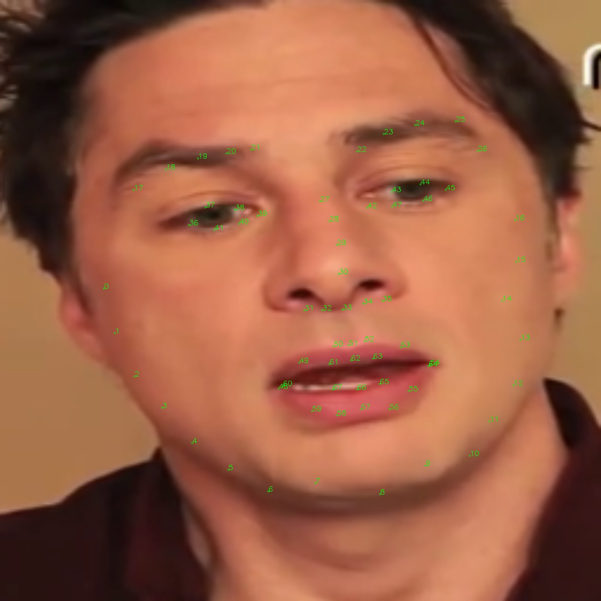

# Fast Face Alignment.

## Overview
An efficient and simplified version of the [face-alignment library](https://github.com/1adrianb/face-alignment).
It runs purely in torch (without numpy computations) and is much faster, but less accurate.

The most important modifications:
- Support only 2d landmarks.
- Face detection removed (as we always have the face in the middle of the picture).
- Slow numpy heatmap to x, y conversion algorithm is replaced by a vectorized one
  similar to the keypoint detector.

## Landmarks

68 landmarks are detected:

